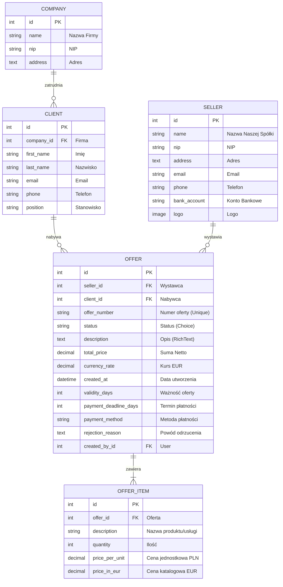
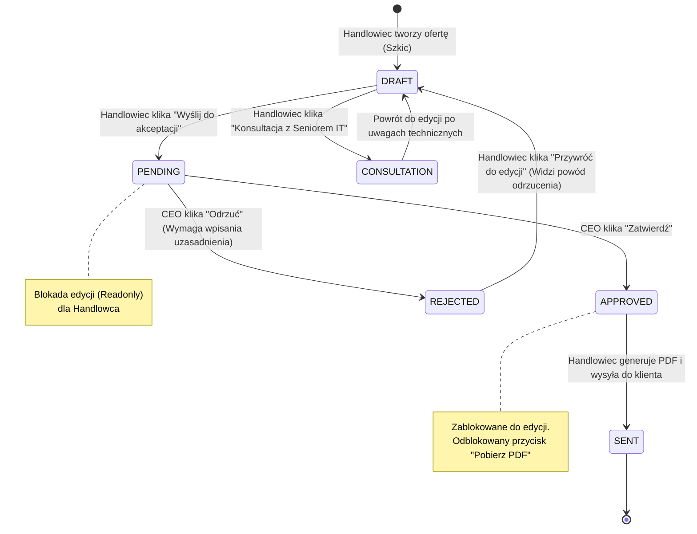

# 🚀 System Ofertowania B2B (Django CRM)

Kompleksowa aplikacja webowa typu CRM przeznaczona do automatyzacji, weryfikacji i generowania ofert handlowych w sektorze B2B. System usprawnia komunikację na linii **Handlowiec ↔ CEO ↔ Dział Techniczny**, eliminuje błędy w kalkulacjach finansowych oraz automatyzuje generowanie ujednoliconych dokumentów PDF.

Projekt został zrealizowany w zwinnej metodyce **SCRUM** (Solo Scrum) w okresie od **25 kwietnia 2026 r. do 6 czerwca 2026 r.**

---

## 📋 1. Opis i Założenia Projektu

System rozwiązuje realny problem biznesowy, jakim jest "ręczne" tworzenie ofert w arkuszach kalkulacyjnych (Excel) oraz brak kontroli nad obiegiem zatwierdzeń dokumentów. 

### Kluczowe Funkcjonalności:
*   **Zarządzanie bazą CRM**: Baza firm partnerskich, baza osób kontaktowych (klientów) oraz baza własnych spółek handlowych (wystawców wraz z kontami bankowymi i logotypami).
*   **Kreator Kosztorysów**: Dynamiczne dodawanie pozycji oferty (JS) z automatycznym wyliczaniem kwot Netto, VAT (23%) oraz Brutto przy użyciu sygnałów Django na poziomie bazy danych.
*   **Zwinny Obieg Dokumentów**: Sztywny podział uprawnień i blokada edycji ofert zatwierdzonych lub oczekujących (ACL).
*   **Feedback Loop**: Obowiązkowy formularz podania powodu odrzucenia oferty przez CEO wraz z natychmiastowym powiadomieniem dla handlowca.
*   **Automatyczny Generator PDF**: Tworzenie profesjonalnych ofert w formacie PDF jednym kliknięciem za pomocą silnika `WeasyPrint`.

---

## 🛠️ 2. Stos Technologiczny

*   **Backend**: Python 3.11+, Django 5.x (MVC Architecture)
*   **Frontend**: HTML5, CSS3, Bootstrap 5 (Responsive Web Design), Vanilla JS
*   **Baza danych**: SQLite (Dev) / PostgreSQL ready
*   **Silnik PDF**: WeasyPrint (wymaga bibliotek systemowych Cairo i Pango)
*   **Edytor tekstu**: CKEditor (Rich Text Field dla opisów SOW)

---

## 📊 3. Architektura Systemu i Bazy Danych

### Diagram Związków Encji (ERD):
Aplikacja przechowuje dane w pięciu powiązanych ze sobą tabelach. Poniższy schemat przedstawia strukturę relacyjną:



---

## 🔄 4. Maszyna Stanów (Obieg Dokumentów)

Oferta przechodzi przez ściśle zdefiniowane statusy, co gwarantuje pełne bezpieczeństwo danych i przejrzystość procesu:



---

## ⚙️ 5. Instrukcja Instalacji i Uruchomienia

Aby uruchomić projekt lokalnie na swoim komputerze:

### 1. Sklonuj repozytorium:
```bash
git clone <adres_Twojego_repozytorium>
cd offert_system_basic
```

### 2. Utwórz i aktywuj środowisko wirtualne:
```bash
python3 -m venv venv
source venv/bin/activate  # Dla Mac/Linux
# venv\Scripts\activate   # Dla Windows
```

### 3. Zainstaluj zależności:
```bash
pip install -r requirements.txt
```


### 4. Wykonaj migracje bazy danych:
```bash
python manage.py migrate
```

### 5. Utwórz konto administratora :
```bash
python manage.py createsuperuser
```
*(Postępuj zgodnie z komunikatami w terminalu: podaj nazwę użytkownika, email i hasło).*

### 6. Uruchom serwer deweloperski:
```bash
python manage.py runserver
```
Aplikacja będzie dostępna w przeglądarce pod adresem: [http://127.0.0.1:8000/](http://127.0.0.1:8000/)

---

## 👥 6. Instrukcja Użytkownika (User Guide)

### Perspektywa 1: Handlowiec (User standardowy)
1.  Zaloguj się na swoje konto.
2.  Przejdź do **Kreatora Ofert** klikając "+ Nowa Oferta".
3.  Wybierz Wystawcę, Klienta, wpisz opis zakresu prac, określ terminy ważności i płatności.
4.  W tabeli pozycji wpisz nazwę usługi, ilość i cenę jednostkową netto. Użyj przycisku "Dodaj kolejną pozycję", aby rozszerzyć kosztorys. Kliknij "Zapisz".
5.  W szczegółach oferty zobaczysz automatycznie wygenerowany numer oferty oraz precyzyjne podsumowanie (Suma Netto, podatek VAT 23% oraz sumę Brutto).
6.  Kliknij "Wyślij do CEO", aby przekazać dokument do weryfikacji. Oferta zostanie zablokowana do edycji (status `Oczekuje na akceptację`).

### Perspektywa 2: CEO / Manager (Superuser / Administrator)
1.  Zaloguj się na konto z uprawnieniami administratora.
2.  Na liście ofert zobaczysz statusy wszystkich dokumentów.
3.  Przy ofertach ze statusem `Oczekuje na akceptację` pojawią się akcje:
    *   **Zatwierdź (Zielony przycisk ✔)**: Zmienia status na `Zatwierdzona`. Handlowiec ma teraz możliwość pobrania oficjalnego pliku PDF.
    *   **Odrzuć (Czerwony przycisk ✘)**: Przekierowuje do formularza odrzucenia. **Musisz podać pisemny powód odrzucenia** (np. "Zbyt niska marża, popraw ceny o 10%"). Handlowiec natychmiast zobaczy to uzasadnienie w czerwonym boksie i będzie mógł poprawić dokument.

---

## 📂 7. Metodyka SCRUM (Dokumentacja Akademicka)

Projekt został w 100% zaimplementowany zgodnie ze standardami inżynierii oprogramowania w zwinnej metodyce SCRUM. Pełna dokumentacja projektowa znajduje się w katalogu [docs/scrum/](file:///Users/jakuba/projekty/offert_system_basic/docs/scrum):

*   **[Karta Projektu](file:///Users/jakuba/projekty/offert_system_basic/docs/scrum/00_project_charter.md)**: Założenia biznesowe, analiza wymagań, Definition of Done (DoD).
*   **[Product Backlog](file:///Users/jakuba/projekty/offert_system_basic/docs/scrum/01_product_backlog.md)**: 11 historyjek użytkownika (User Stories) z kryteriami akceptacji, estymacją w Story Points i priorytetami MoSCoW.
*   **[Log Sprintu 1 (25.04 – 08.05.2026)](file:///Users/jakuba/projekty/offert_system_basic/docs/scrum/02_sprint_1.md)**: Fundamenty CRM, baza danych, planowanie, dane do wykresu Burndown, retrospektywa.
*   **[Log Sprintu 2 (09.05 – 22.05.2026)](file:///Users/jakuba/projekty/offert_system_basic/docs/scrum/03_sprint_2.md)**: Kreator kosztorysów, formularze i logika kalkulacji finansowych.
*   **[Log Sprintu 3 (23.05 – 05.06.2026)](file:///Users/jakuba/projekty/offert_system_basic/docs/scrum/04_sprint_3.md)**: Maszyna stanów, generator PDF, szlify UX i naprawa błędów CSS.
*   **[Skrypt symulacji Git](file:///Users/jakuba/projekty/offert_system_basic/docs/scrum/git_simulate.sh)**: Skrypt Bash generujący historyczny rejestr 14 commitów odzwierciedlający naszą pracę w tych sprintach.

---
Autor: **Jakub**
Okres Akademicki: **Semestr Letni 2026**
Metodyka Zwinna: **SCRUM / Solo Scrum**
